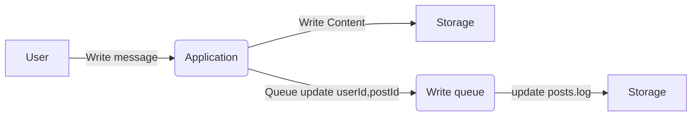
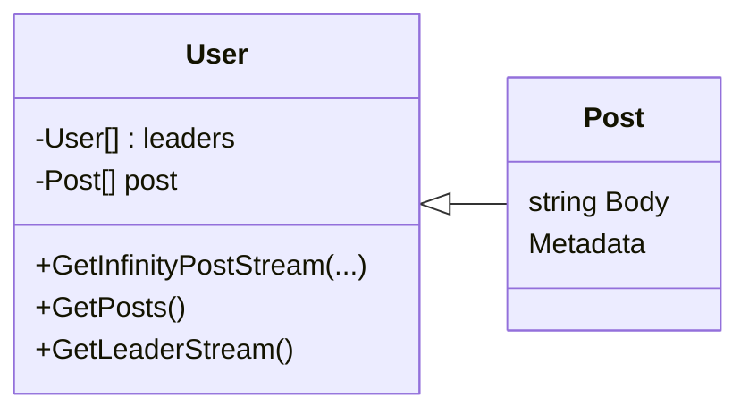
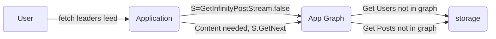
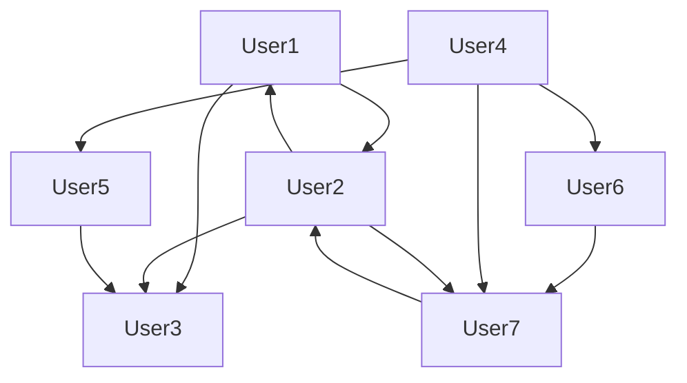

# Message sharing app

A design for a large scale message sharing applications, we setup the following assumptions

Conditions
* Users read from others users that they follow, and their followers, up to 3 levels
* Number of registered users: 10_000_000_000	
* Number of active active users: 10_000_000
* Average posts pr posting user pr day: 10
* Users posting: 50%
* post pr day: 50_000_000	
* post size: 2kb
* write: 100 gb/day
* write rate: 1 mb/s
* 60% of active users reads every Minute
* reads in chunks of 10 tweets
* Read rate: 2gb/s  

## Some desired parameters
* Write should not require any blocking
* The large number of users will be divided into application pr. region, optionally multiple pr. region.
* Active users and pr region will be kept in ram to optimize response time
* Leaders of active users will be kept in ram to optimize response time
* Active users and Leaders have 
  * Data lazy loaded on request
  * Unloads when not accessed for a specific time
  * Loads new data on read request if new data is available


By using either raw disk, or a database, we can structure the user data such that writes requires no locking, and reading only becomes necessary if no data was read in an application instance, or a timestamp was updated since last read pr application instance. For simplicity I will show how it can be arranged  using a file structure layout.

Path | Purpose 
-- | --
{userId}/profile | Profile information for instance {username}
{userId}/lastPost | timestamp of last post, used by running app instances to refresh data _when requested_
{userId}/posts/{postId} | post content put in files
{userId}/posts.log | log of posts to ensure the order of the posts are known
{userId}/leaders/{userId} | Map of users this users follows

## Write
* Message can be written without locks given {userId}/posts/{postId} that are both globally unique identifiers (Guids)
* post.log can be updated using a queue, the write content is always less and can happen faster than the 2kb post


The last step is to ensure of the same users creates multiple post at the same time the post.log will not be corrupted.

## Read
* Reading becomes more interesting as we should be able to deliver 2gb/s
* To keep the disk read to a minimum, we want to make a design where data is only read when needed, and only kept in memory for some time, users and followers are represented as nodes when they are loaded in an application instance, and the data is lazy loaded when needed

The read post will be the most intensive operation, by maintaining the graph 



The graph could look like the following

The users in the graph in memory are there because they are active or the followers are active, posts are loaded into the graph as User attributes when requested, and kept in memory

The following Pseudo code shows a concept that
* Allows infinity scrolling
* Only Uses pointers to the Users and Posts in the Graph
* Maintains an Infinity scrolling state pr. user thus minimizing memory usage
* Samples posts from leaders based on popularity
  * Does the sampling using a recursive function that has a __memory footprint = number of edges visited in the current scrolling journey__

```cs
// Method that keeps returning as long as the iterator is called
// This allows infinity scrolling
// Memory allocation corresponds to the number of posts for the leaders
IEnumerable<Post> GetInfinityPostStream(bool includeMyPosts) {
    // continues scroll, this is destroyed when the iterator goes out of scope
    while (true) {
        if (includeMyPosts)
            while (myPosts.hasData)
                yield return myPosts.pop();
            
        var leaders = GetLeaders(...)
            .SortBy(P => P.Popularity);

        // Create dictionary of leader stream sources corresponding to the edge in the graph to consume data from
        var leaderStreamSources = new Dictionary<User, IEnumerable<Post>>();
        
        while (true) {
            var leader = PickRandomLeaderAccordingToPopularity()
            if ( ! leaderStreamSourcers.Contains(leader))
                leaderStreamSourcers.Add(
                    leader.GetInfinityPostStream(true));
            yield return leaderStreamSourcers[leader]
                .Next();
        }
    }
}

// reads the post from a user if required
// requires is true if nothing was ever read, 
// or if there are new posts from the users
IEnumerable<Post> GetPosts() {
    if (RequiresLoad)
        post = postService.FetchUserPostsFromStorage(userId)
    return posts;
}

// Fetching the leaders, 
// do not fetch or load the post, before the posts are fetched from the leaders this minimizes memory usage
// Notice the use of usersService, this fectes the users from the existing graph or adds and returns a users to the graph
// The service also unloads users according to an optimization strategy
IEnumerable<User> GetLeaders() {
    if (RequiresLoad)
        leaders = usersService.FetchFromStorage(leaderIds)
    return leaders;
}

```