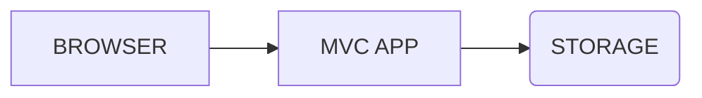
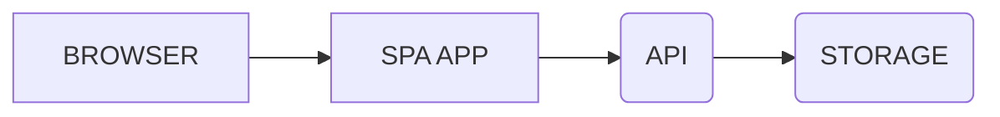
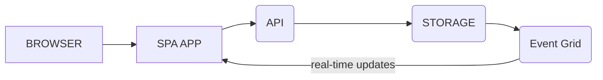

# Example possibilities, planet-scale, real-time
## Supply and demand
* Monitoring in real-time of stock in warehouses
* real-time availability update on orders (instant)
* Monitoring of vending machines real-time
* End customer purchase from vending machine with app=real-time monitoring of end customer purchase
    * Show a story of the product, where and when it was produced and the route it took to reach you 😍

## Fleet monitoring
* View where the fleet is
* view where the products are

# Solutions considerations

## MVC style app to control supply and demand
MVC is the classical architecture where a server sends the content to the browser, the server also needs to remember a bit about what the user is doing (session)

* +simple to implement
* -might not scale to planet size natively, (requires load-balancers and fiddling)
* -Requires ram on the server pr active user

## SPA style app
A SPA=Single page application is a application/website that is running in the browser on the client machine.

Planet scale, no centralized memory limit

* +Scale to planet size cloud native (using functions or lambda)
* -higher upfront cost, more complicated to implement and develop in the beginning
* slow start-uptime if lots of functionality is added (can be prevented using multiple focused apps, for instance one app for fleet monitoring, and one for supply and demand)

## Adding real-time updates
real-time monitoring can be added without overloading the API using a mesh communication infrastructure triggered by storage changes, for example using [Azure event grid](https://learn.microsoft.com/en-us/azure/event-grid/overview)

